  
  <h1>Vibe</h1>
  
<strong>Build websites using the power of LLMs.</strong>

  

    <a href="#features">Features</a> •
    <a href="#how-it-works">How It Works</a> •
    <a href="#tech-stack">Tech Stack</a> •
    <a href="#getting-started">Getting Started</a>
  

---

## Overview

**Vibe** is an intelligent web application that empowers users to generate fully functional React/Next.js applications simply by describing them. Using advanced AI agents running in secure sandboxed environments, Vibe interprets user prompts, writes code, and deploys a live preview instantly.

Whether you're prototyping an idea or building a full dashboard, Vibe handles the heavy lifting of coding, styling (with Tailwind CSS), and component assembly.

_(Note: Add a `demo.png` to your `public` folder to show a screenshot of the app interface)_

## Features

- **AI-Powered Code Generation**: Utilizes OpenAI's Code-Agent to understand requirements and generate high-quality code.
- **Sandboxed Execution**: Runs generated code securely using **E2B Code Interpreter**, ensuring isolation and safety.
- **Smart Agents**: Powered by **Inngest** to orchestrate multi-step agentic workflows (planning, coding, fixing).
- **Live Preview**: Instantly view and interact with the generated application in a secure iframe.
- **Project Management**: Create, view, and manage multiple projects with persistent history.
- **Modern UI**: Built with **Shadcn UI** and **Tailwind CSS** for a sleek, responsive design.
- **Secure Authentication**: Integrated with **Clerk** for robust user management.

## Tech Stack

- **Framework**: Next.js 15
- **Language**: TypeScript
- **Database**: PostgreSQL, Prisma ORM
- **Authentication**: Clerk
- **AI & Agents**:
  - AI Code-Agent
  - Inngest
  - E2B
- **Styling**: Tailwind CSS, Shadcn UI
- **API Integration**: tRPC, TanStack Query

## Architecture Overview

Vibe uses a sophisticated multi-agent system to turn text into code. The interaction flows from the client to a background workflow that orchestrates AI agents and secure sandboxes.

```mermaid
sequenceDiagram
    participant Client as 🖥️ Client (Browser)
    participant TRPC as 🚀 tRPC API
    participant DB as 🗄️ Database (Prisma/Postgres)
    participant Inngest as ⚙️ Inngest (Background Workers)
    participant Agent as 🤖 AI Agent
    participant E2B as 🏗️ E2B Sandbox

    Client->>TRPC: Submit Prompt (projects.create)
    TRPC->>DB: Create Project & Initial Message
    TRPC->>Inngest: Trigger event 'code-agent/run'
    TRPC-->>Client: Success (Redirect to Project Page)

    Inngest->>E2B: Initialize Sandbox (Next.js environment)
    Inngest->>Agent: Prompt Agent with requirements

    loop Agentic Workflow
        Agent->>E2B: Run Terminal Commands (npm install)
        E2B-->>Agent: Command Output
        Agent->>E2B: Create/Update Files (app/page.tsx, etc.)
        E2B-->>Agent: Confirmation
    end

    Inngest->>Agent: Generate Final Summary & Title
    Inngest->>E2B: Get Sandbox Host URL
    Inngest->>DB: Save Assistant Message & Fragment (Files, URL)

    loop Polling/Live Updates
        Client->>TRPC: Fetch Project Data
        TRPC->>DB: Read Messages & Fragments
        DB-->>TRPC: Data
        TRPC-->>Client: Show AI Response & Live Preview (Iframe)
    end
```

## Detailed Flow

1.  **Client Submission**: The user enters a prompt. The frontend sends a tRPC mutation to create a project and record the request.
2.  **Workflow Trigger**: An Inngest event is dispatched, decoupling the slow AI generation process from the fast API response.
3.  **Sandbox Provisioning**: E2B spins up a fresh, secure Linux micro-VM with a pre-configured Next.js environment.
4.  **Agent Logic**: The AI agent (powered by Inngest Agent Kit) enters a loop where it can:
    - **Think**: Analyze the user's request.
    - **Execute**: Run shell commands or write React components to the sandbox.
    - **Validate**: Read files to ensure everything is correct.
5.  **Persistence**: Once the agent finishes, the "state" (code files and sandbox URL) is saved to the database.
6.  **Real-time UI**: The frontend, polling for updates via TanStack Query, detects the new message and displays the interactive preview via an iframe pointing to the E2B sandbox.
